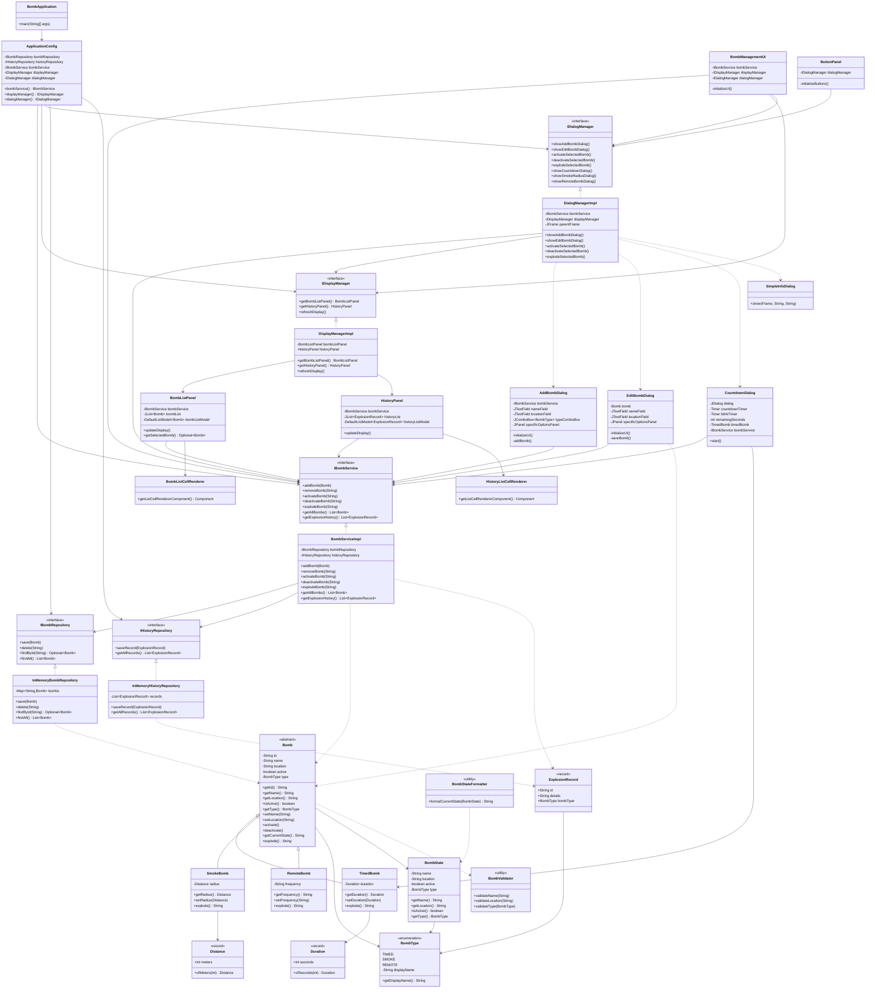

# Java OOP Bomb Management Simulation

Welcome to the Java OOP Bomb Management Simulation repository. This repository contains resources and examples to help you understand Object-Oriented Programming (OOP) concepts in Java through a bomb management simulation application.

## Table of Contents

- [Introduction](#introduction)
- [Getting Started](#getting-started)
- [Running the Application](#running-the-application)
- [Key Concepts](#key-concepts)
- [Examples](#examples)
- [Contributing](#contributing)
- [License](#license)

## Introduction

This repository is designed to provide a comprehensive guide to OOP in Java using a bomb management simulation application. It includes explanations of key concepts, code examples, and best practices.

## Getting Started

To get started with this repository, clone it to your local machine using the following command:

```bash
git clone https://github.com/yourusername/javaoop-reff.git
```
## Compile java files
To compile all the java files run this command

```bash
javac -d out application/BombApplication.java
```
with input entry point of the application file, java compiler will automatically find and compile all the files


## Running the Application

To run the application, navigate to the `/out` directory and execute the following command:

```bash
java application.BombApplication
```

## Key Concepts

- **Classes and Objects**: Learn about the building blocks of OOP.
- **Inheritance**: Understand how classes can inherit properties and methods from other classes.
- **Polymorphism**: Explore how objects can take on multiple forms.
- **Encapsulation**: Discover how to protect the internal state of an object.
- **Abstraction**: Learn how to simplify complex systems by modeling classes appropriate to the problem.

## Examples

This section contains practical examples to illustrate OOP concepts in Java. Each example is located in the `examples` directory.

## Contributing

Contributions are welcome! Please read the [contributing guidelines](CONTRIBUTING.md) before submitting a pull request.

## License

This project is licensed under the MIT License. See the [LICENSE](LICENSE) file for details.


